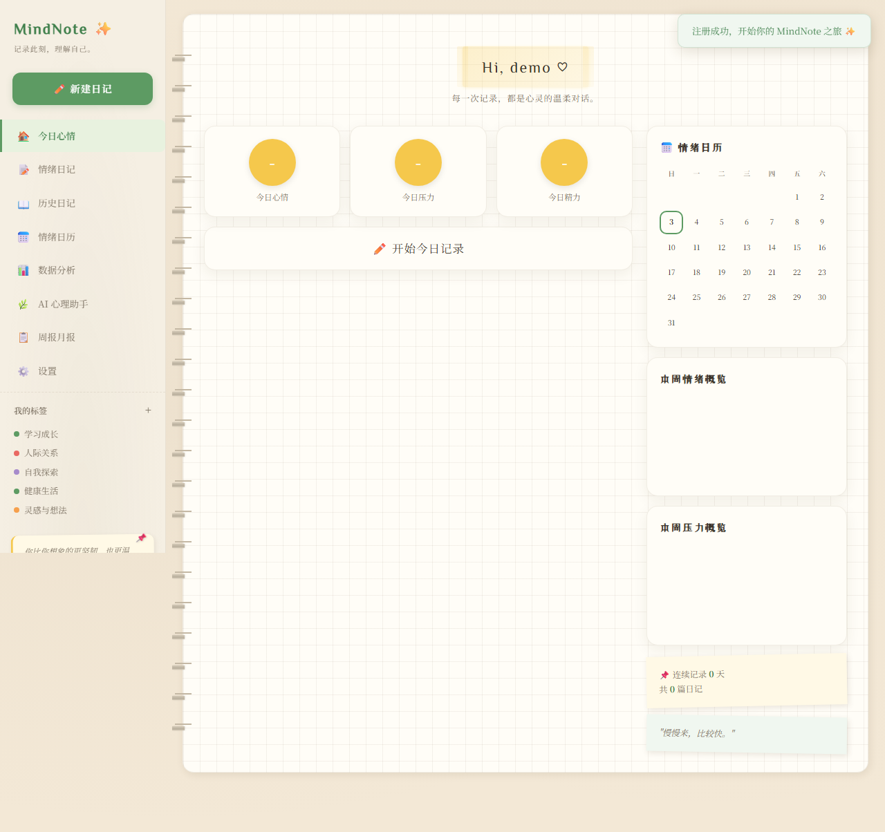
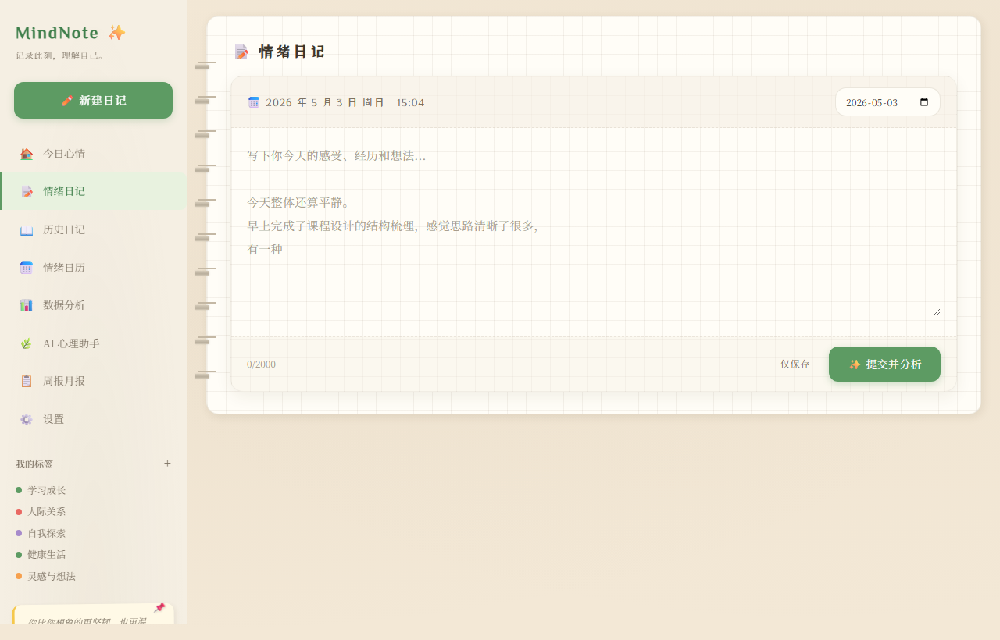
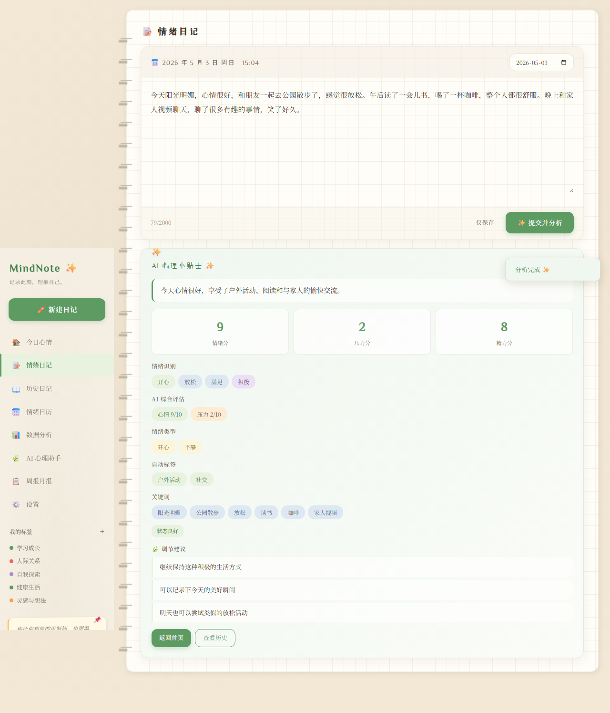
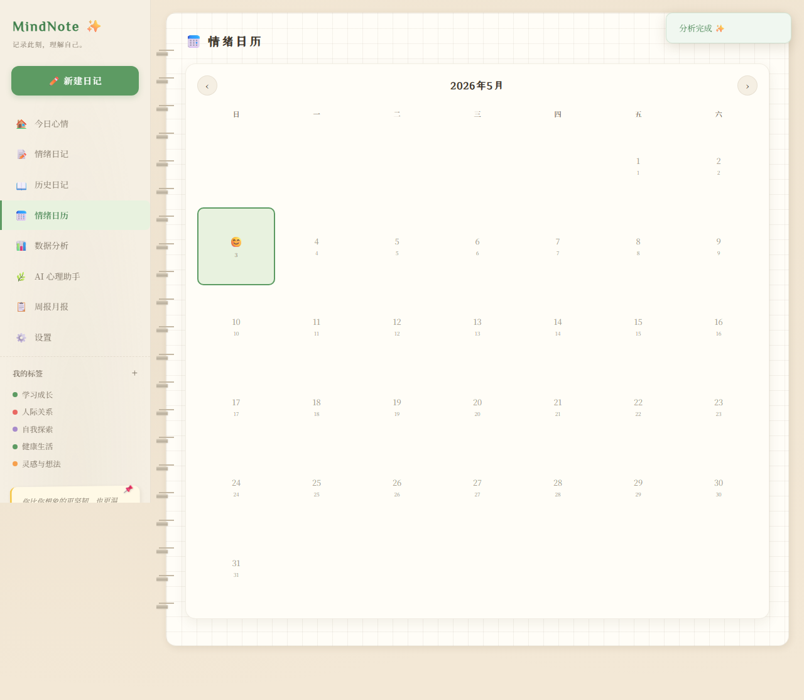
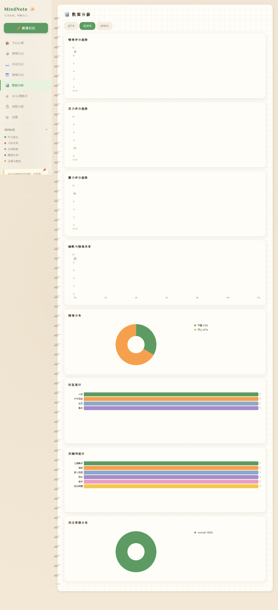
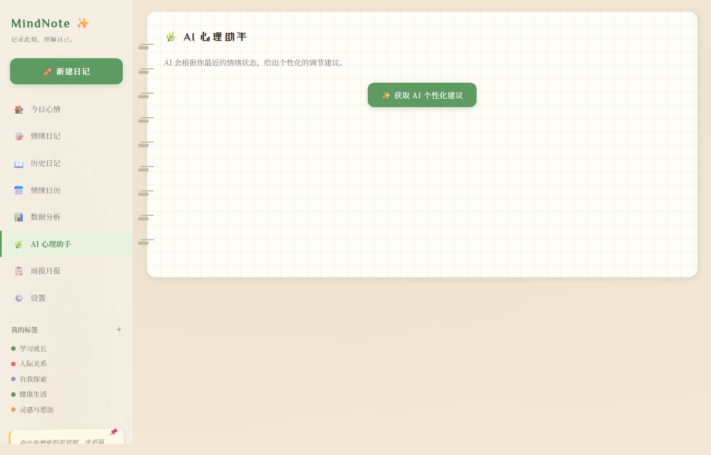
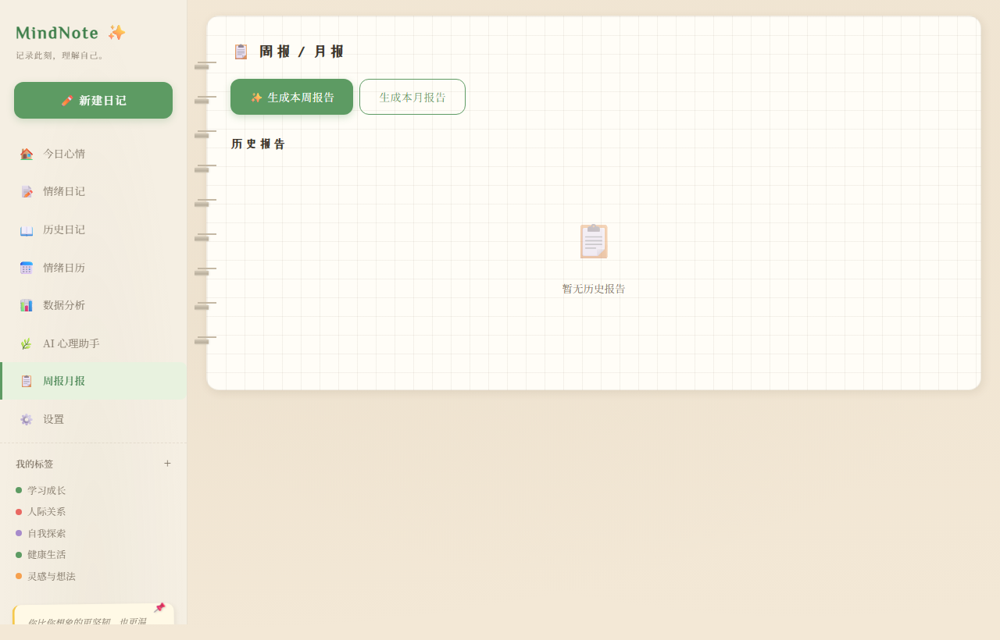

# MindNote - 个人情绪记录与 AI 心理状态分析网站

> 写下你的故事，AI 帮你温柔倾听。发现情绪的纹理，拥抱每一个真实的自己。

MindNote 是一个基于 Flask + SQLite 的个人情绪管理 Web 应用。用户通过文字日记记录日常心情，系统调用 DeepSeek AI 对日记内容进行深度分析，自动识别情绪类型、评估心理状态，并以卡片、图表、日历和报告等多种形式呈现分析结果，帮助用户进行日常情绪管理和自我观察。

**项目定位**：日常情绪管理与自我观察工具，非医疗诊断系统。所有 AI 分析结果仅供个人参考，不涉及心理疾病诊断。

---

## 功能预览

### 登录页面

手帐封面风格的登录界面，左侧表单 + 右侧装饰插画，配合浮动动画元素。


### 首页 - 今日心情

登录后的主页面，展示欢迎胶带、情绪评分概览、连续记录天数、迷你日历和趋势图表。



### 情绪日记

方格纸风格的日记编辑器，写下今天的感受后点击"提交并分析"，AI 会自动进行情绪分析。



### AI 分析结果

AI 分析完成后展示完整的心理状态报告：情绪分/压力分/精力分、情绪识别、自动标签、压力来源、关键词提取和调节建议。



### 情绪日历

月历视图展示每天的情绪状态，用表情符号直观反映心情变化趋势。



### 数据分析

多维度 Canvas 图表：情绪/压力趋势曲线、情绪类型分布饼图、关注等级统计等。



### AI 心理助手

AI 根据近期日记数据生成个性化的心理调节建议、每日心语和关注方向。



### 周报月报

AI 自动生成周度/月度情绪分析报告，总结情绪走势和调节效果。



---

## 核心功能

| 功能模块 | 说明 |
|---------|------|
| 用户系统 | 注册 / 登录 / Session 管理 |
| 情绪日记 | 文字日记记录，支持保存草稿和提交分析 |
| AI 情绪分析 | DeepSeek AI 自动评估情绪分/压力分/精力分、识别情绪类型、提取关键词、生成建议 |
| 情绪日历 | 月历视图展示每日情绪，表情符号直观呈现 |
| 数据图表 | 自定义 Canvas 图表：趋势线、饼图、柱状图 |
| AI 建议 | 基于历史记录的个性化心理调节建议 |
| 周报月报 | AI 生成周度/月度情绪分析报告 |
| 历史管理 | 日记列表浏览、筛选、查看详情、编辑、删除 |

---

## 技术架构

```
┌─────────────────────────────────────────────────┐
│                    前端 (SPA)                     │
│  HTML + CSS + Vanilla JavaScript                 │
│  自定义 Canvas 图表 / 自定义 UI 组件              │
├─────────────────────────────────────────────────┤
│                  Flask 后端                       │
│  路由层 (routes/) → 服务层 (services/)            │
│  Session 会话管理 / RESTful API                   │
├─────────────────────────────────────────────────┤
│              SQLite 数据库                        │
│  users / mood_records / reports                  │
├─────────────────────────────────────────────────┤
│            DeepSeek AI API                        │
│  日记分析 / 报告生成 / 个性化建议                  │
└─────────────────────────────────────────────────┘
```

### 技术栈

- **后端**：Python Flask + Flask-CORS + Flask-Session
- **数据库**：SQLite（轻量级，无需额外安装）
- **AI**：DeepSeek API（deepseek-v4-flash 模型，OpenAI 兼容协议）
- **前端**：纯 HTML / CSS / JavaScript 单页应用（SPA）
- **图表**：Canvas API 自定义绘制（无第三方图表库）
- **UI 风格**：手帐 / 治愈风日记本主题

### 项目结构

```
├── app.py                  # Flask 主入口
├── config.py               # 配置文件（API Key 从环境变量读取）
├── init_db.py              # 数据库初始化脚本
├── requirements.txt        # Python 依赖
├── .env.example            # 环境变量模板
│
├── models/
│   └── database.py         # 数据库连接与表结构
│
├── routes/                 # API 路由层
│   ├── auth.py             # 用户认证 API
│   ├── mood.py             # 心情记录 CRUD API
│   ├── ai.py               # AI 分析 API
│   ├── stats.py            # 统计数据 API
│   └── report.py           # 报告 API
│
├── services/               # 业务逻辑层
│   ├── ai_service.py       # DeepSeek AI 交互
│   ├── auth_service.py     # 用户认证逻辑
│   ├── mood_service.py     # 心情记录管理
│   ├── stats_service.py    # 数据统计
│   ├── report_service.py   # 报告生成
│   └── suggestion_service.py # 建议服务
│
├── static/
│   ├── css/style.css       # 全局样式（手帐主题）
│   ├── js/                 # 前端 SPA 模块
│   │   ├── app.js          # 核心路由与公共方法
│   │   ├── auth.js         # 登录注册
│   │   ├── home.js         # 首页
│   │   ├── record.js       # 日记编辑
│   │   ├── history.js      # 历史记录
│   │   ├── calendar.js     # 情绪日历
│   │   ├── charts.js       # 数据图表
│   │   ├── report.js       # 周报月报
│   │   └── suggestion.js   # AI 建议
│   └── images/             # 静态图片资源
│
└── templates/
    └── index.html          # SPA 入口模板
```

---

## 快速开始

### 环境要求

- Python 3.8+
- DeepSeek API Key（[获取地址](https://platform.deepseek.com)）

### 安装步骤

**1. 克隆仓库**

```bash
git clone https://github.com/Eng-i-neer/emotion-analyze-web.git
cd emotion-analyze-web
```

**2. 安装依赖**

```bash
pip install -r requirements.txt
```

**3. 配置环境变量**

复制 `.env.example` 为 `.env`，填入你的 DeepSeek API Key：

```bash
cp .env.example .env
```

编辑 `.env` 文件：

```
DEEPSEEK_API_KEY=your-deepseek-api-key-here
SECRET_KEY=your-secret-key-here
```

**4. 启动应用**

```bash
python app.py
```

访问 http://localhost:5001 即可使用。

---

## API 接口

| 方法 | 路径 | 说明 |
|------|------|------|
| POST | `/api/auth/register` | 用户注册 |
| POST | `/api/auth/login` | 用户登录 |
| POST | `/api/auth/logout` | 退出登录 |
| GET | `/api/auth/me` | 获取当前用户 |
| GET | `/api/mood-records` | 获取记录列表 |
| POST | `/api/mood-records` | 创建新记录 |
| GET | `/api/mood-records/:id` | 获取单条记录 |
| PUT | `/api/mood-records/:id` | 更新记录 |
| DELETE | `/api/mood-records/:id` | 删除记录 |
| POST | `/api/ai/analyze-diary` | AI 分析日记 |
| POST | `/api/ai/suggestions` | 获取 AI 建议 |
| GET | `/api/stats/overview` | 统计概览 |
| GET | `/api/stats/trends` | 趋势数据 |
| GET | `/api/stats/calendar` | 日历数据 |
| POST | `/api/reports/generate` | 生成报告 |
| GET | `/api/reports` | 获取报告列表 |

---

## AI 分析说明

系统通过 DeepSeek AI 对用户日记文本进行多维度分析：

- **情绪识别**：主要情绪 + 次要情绪识别，情感倾向判断（积极/中性/偏低落）
- **量化评估**：情绪分、压力分、精力分（1-10 分制）
- **智能标签**：自动提取情绪类型、关键词、压力来源
- **关注等级**：normal（状态良好）/ watch（留意观察）/ high（需要关注）
- **调节建议**：基于分析结果给出 3-5 条温和的、非医疗性质的建议
- **睡眠评估**：根据日记内容推断睡眠时长和质量

> 所有评分和标签均由 AI 根据日记文本自动生成，用户只需要写日记即可，无需手动评分。

---

## UI 设计理念

采用「治愈系手帐日记本」设计风格：

- **纸张质感**：方格纸纹理背景、纸张颗粒感
- **装订效果**：笔记本装订环、胶带标题装饰
- **低饱和配色**：米色底（#F3E8D6）、暖白纸面（#FFFDF7）、苔藓绿（#5D9B63）、暖黄（#F5C84C）
- **手写字体**：ZCOOL XiaoWei、Ma Shan Zheng、Caveat
- **柔和动画**：页面切换淡入、卡片浮现、装饰元素漂浮
- **全自定义组件**：所有弹窗、下拉选择、提示框均为原生自定义组件，不使用浏览器默认样式

---

## 注意事项

- 本项目为课程设计作品，适用于个人情绪管理和自我观察
- AI 分析结果仅供参考，不构成任何医疗建议或心理诊断
- API Key 请妥善保管，不要提交到公共仓库
- 数据存储在本地 SQLite 文件中，不会上传到任何服务器

---

## License

本项目为课程设计作品，仅供学习交流使用。
